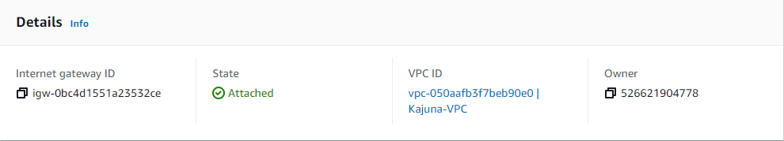
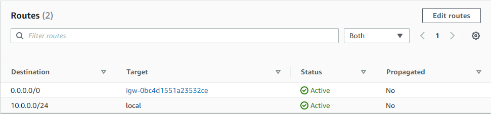
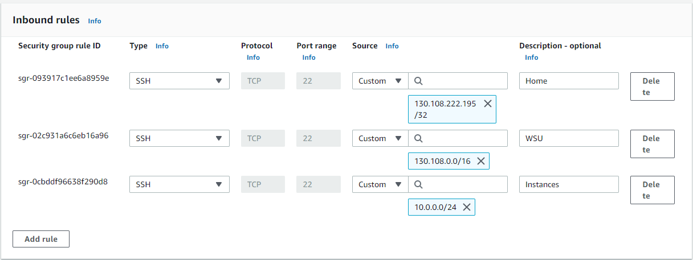
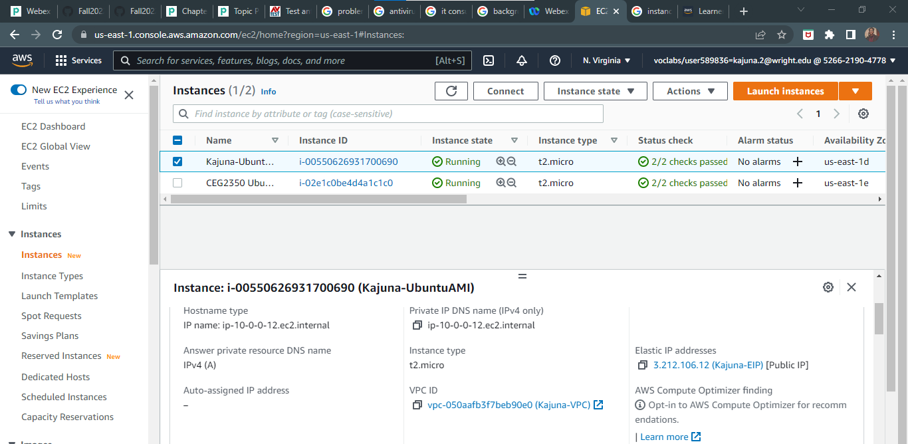
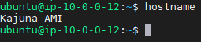

# Part 1
## VPC
- Kajuna-VPC
- 10.0.0.0/24
- a private part of AWS that allows you to use AWS resources.

## Subnet
- Kajuna-subnet
- 10.0.0.0/28
- range of IP addresses in Kajuna-VPC

## Internet Gateway
- Kajuna-Gateway
- Allows to communicate to public internet

## Route Table
- Kajuna-route
- set of rules to determine network traffic

## Security Group
- Kajuna-SecurityGroup
- controls traffic for VPC instance

# Part 2
1. Ubuntu AMI
	- t2.micro
2. Connect VPC thouth Network settings
3. Auto-assign IP address b/c it removes stress of keeping track.
4. Create and attach storage volume through making of instance.
5. Tag instance while creating instance.
6. Associate VPC security group with instance by adding rules for traffic.
7.Allocate and associate elastic IP address.

9. sudo hostnamectl set-hostname Kajuna-AMI

